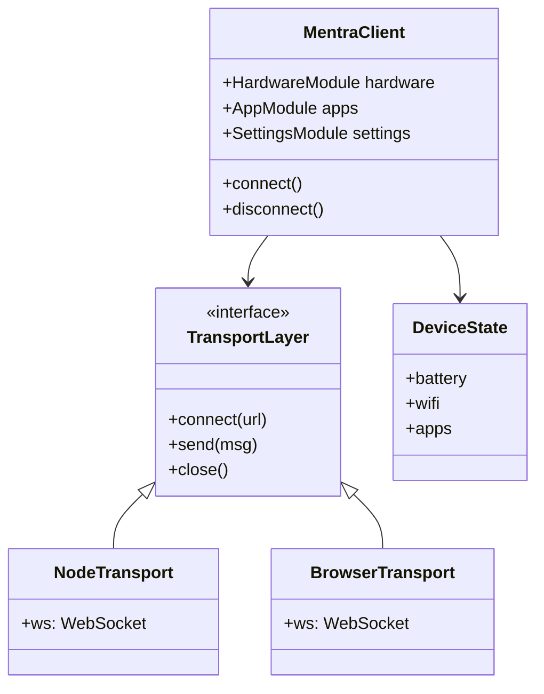

# Client SDK Architecture

## System Design



## Modules

### 1. Transport Layer
Abstracts the WebSocket implementation.
- **Node.js**: Uses `ws` package.
- **Browser**: Uses native `WebSocket` API.

### 2. Protocol Layer
Handles message serialization/deserialization.
- Validates incoming messages against `@mentra/types`.
- Wraps outgoing messages in standard envelopes.

### 3. State Management
Maintains local device state.
- **Battery**: Tracks level and charging status.
- **WiFi**: Tracks connection status.
- **Apps**: Tracks running apps.

### 4. Capability Manager
Enforces hardware constraints.
- Checks if device has required hardware (e.g., Camera) before allowing related events.

## Directory Structure

```
packages/client-sdk/
├── src/
│   ├── index.ts              # Public API
│   ├── client.ts             # MentraClient class
│   ├── transport/            # Transport implementations
│   │   ├── interface.ts
│   │   ├── node.ts
│   │   └── browser.ts
│   ├── modules/              # Functional modules
│   │   ├── hardware.ts
│   │   ├── apps.ts
│   │   └── settings.ts
│   └── state/                # State management
│       ├── device-state.ts
│       └── capabilities.ts
├── package.json
└── tsconfig.json
```
