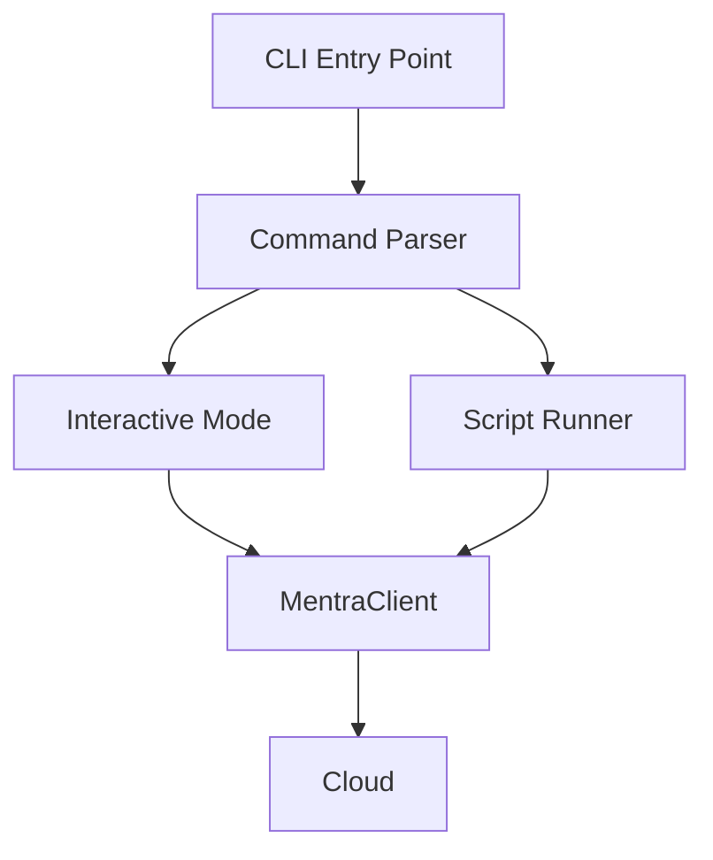

# CLI Tool Architecture

## System Design

The CLI is a Node.js application wrapping the `@mentra/client-sdk`.



## Components

### 1. Command Parser
Uses `commander` or `yargs` to parse arguments and subcommands.

### 2. Interactive Shell
Uses `inquirer` or `readline` for the REPL loop.
- Parses user input (e.g., "press main").
- Maps input to SDK calls.
- Formats SDK events (logs) for display.

### 3. Script Runner
Executes JSON-defined test scenarios.
- **Step Executor**: Runs each step sequentially.
- **Assertion Engine**: Verifies expected responses from Cloud.

## Directory Structure

```
packages/cli/
├── src/
│   ├── index.ts              # Entry point
│   ├── commands/             # Command implementations
│   │   ├── simulate.ts
│   │   └── run-script.ts
│   ├── repl/                 # Interactive shell logic
│   │   └── shell.ts
│   └── runner/               # Test runner logic
│       ├── executor.ts
│       └── assertions.ts
├── package.json
└── tsconfig.json
```
