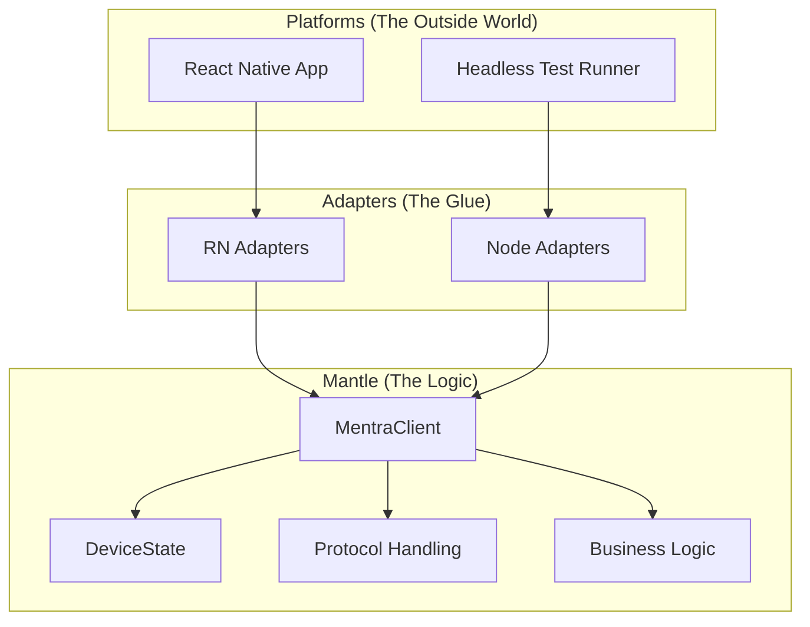

# Mantle Architecture (Shared Client SDK)

## Overview

The `@mentra/client-sdk` is the **Mantle** of the MentraOS Client ecosystem. Instead of being a separate "simulation" library, it is the production logic engine that powers both the **Mentra Mobile App** (React Native) and the **Headless Test Runner** (Node.js).

## Architecture: Hexagonal (Ports & Adapters)

We use a Hexagonal Architecture to isolate the core business logic from the platform-specific implementation details (Network, Storage, Media, Hardware).

### 1. The Mantle (`src/mantle/`)
**Universal Logic**. Pure TypeScript. No platform dependencies.
*   **Protocol**: `SocketComms` (Parsing, Dispatching), `RestComms` (Endpoints).
*   **State**: `DeviceState` (Zustand store), `SettingsStore`, `AppletStore`.
*   **Logic**: `TranscriptProcessor`, `HealthCheckFlow`, `OtaChecker`.
*   **Facade**: `MentraClient` class.

### 2. The Ports (`src/interfaces/`)
**Abstract Contracts**. Defines *what* the Mantle needs, not *how* it's done.
*   `INetworkTransport`: `connect()`, `send()`, `onMessage()`.
*   `IStorage`: `getItem()`, `setItem()`, `removeItem()`.
*   `IMedia`: `playAudio()`, `recordAudio()`, `startRtmp()`.
*   `IHardware`: `scan()`, `connect()`, `sendToDevice()`.
*   `ISystem`: `getPermissions()`, `getNotifications()`.

### 3. The Adapters (`src/platforms/`)
**Concrete Implementations**.
*   **Node.js (`src/platforms/node/`)**:
    *   `NodeTransport`: Uses `ws` and `axios`.
    *   `FileStorage`: Uses `fs` to write to disk.
    *   `MockMedia`: Returns dummy streams/files.
    *   `MockHardware`: Simulates button presses/events.
*   **React Native (`src/platforms/react-native/`)**:
    *   `RNTransport`: Uses native `WebSocket` and `fetch`.
    *   `RNStorage`: Uses `@react-native-async-storage/async-storage`.
    *   `RNMedia`: Uses `expo-av` and `react-native-rtmp`.
    *   `MantleHardware`: Uses Native Modules to talk to Glasses.

## Benefits

1.  **Zero Drift**: The code running in tests is the *exact same code* running in production.
2.  **Testability**: We can unit test complex logic (e.g., "Zombie App" detection) in Node without booting an emulator.
3.  **Velocity**: New features are implemented once in the Core and immediately available to both platforms.

## Migration Strategy

1.  **Extract**: Move logic from `mobile/src/services/SocketComms.ts` -> `sdk/src/core/Protocol.ts`.
2.  **Abstract**: Replace direct `AsyncStorage` calls with `this.platform.storage`.
3.  **Integrate**: Update Mobile App to import `MentraClient` instead of maintaining its own `SocketComms`.

